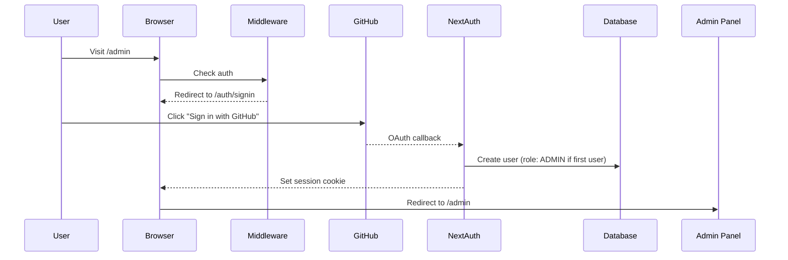

# Quick Start: Admin Login

This is a quick reference for setting up admin login. For detailed information, see [ADMIN_LOGIN_SETUP.md](./ADMIN_LOGIN_SETUP.md).

## TL;DR - What You Need to Know

1. **Admin login URL**: https://olliedoesis.dev/auth/signin
2. **First user to sign in automatically becomes admin**
3. **Authentication is handled by NextAuth.js v5**
4. **Sign in with GitHub OAuth** (email/Google optional)

## 5-Minute Setup

### 1. Configure GitHub OAuth App

```bash
# Go to: https://github.com/settings/developers
# Create new OAuth App with:
# - Homepage: https://olliedoesis.dev
# - Callback: https://olliedoesis.dev/api/auth/callback/github
```

### 2. Set Environment Variables

Add to `.env` or `.env.local`:

```bash
NEXTAUTH_URL=https://olliedoesis.dev
NEXTAUTH_SECRET=<run: openssl rand -base64 32>
GITHUB_ID=<from GitHub OAuth app>
GITHUB_SECRET=<from GitHub OAuth app>
POSTGRES_DATABASE_URL=<your database URL>
```

### 3. Verify Configuration

```bash
npm run verify:auth
```

### 4. Deploy and Sign In

1. Deploy with updated environment variables
2. Visit https://olliedoesis.dev/auth/signin
3. Click "Continue with GitHub"
4. You're now admin! Go to https://olliedoesis.dev/admin

## How It Works



## API Auth Endpoints

Your site automatically has these endpoints:

- **Sign In**: https://olliedoesis.dev/auth/signin
- **Sign Out**: https://olliedoesis.dev/api/auth/signout
- **Session**: https://olliedoesis.dev/api/auth/session
- **Providers**: https://olliedoesis.dev/api/auth/providers

## Protected Routes

These routes require ADMIN role:

- `/admin/*` - All admin pages
- `/api/admin/*` - Admin API routes
- `/api/blogs/*` (POST/PUT/DELETE)
- `/api/projects/*` (POST/PUT/DELETE)
- `/api/tags/*` (POST/PUT/DELETE)
- `/api/upload/*`

## Troubleshooting

| Problem | Solution |
|---------|----------|
| Can't access /admin | Sign in at /auth/signin first |
| "Access Denied" | Check your role in database (should be ADMIN) |
| "Configuration" error | Verify all env vars are set |
| OAuth callback error | Check GitHub OAuth callback URL matches exactly |
| Sign in loop | Verify NEXTAUTH_URL matches your domain |

## Quick Commands

```bash
# Verify auth configuration
npm run verify:auth

# Check users and roles in database
npx prisma studio

# Generate new NEXTAUTH_SECRET
openssl rand -base64 32

# Run database migrations
npx prisma migrate deploy
```

## Need More Help?

- **Detailed Guide**: [ADMIN_LOGIN_SETUP.md](./ADMIN_LOGIN_SETUP.md)
- **Auth Config**: [src/lib/auth.ts](./src/lib/auth.ts)
- **Middleware**: [middleware.ts](./middleware.ts)
- **Sign In Page**: [src/app/auth/signin/page.tsx](./src/app/auth/signin/page.tsx)
